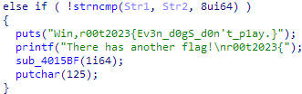
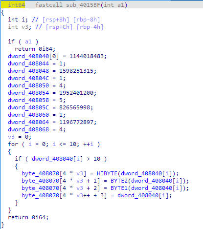
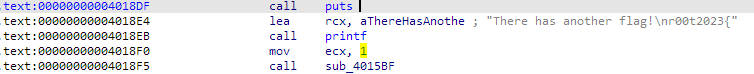

## 这里我要提到一款开放世界RPG游戏  
1,将得到的exe文件放入exeinfo,发现为64位可执行文件且没有加壳。  
2，放入IDA64中，反编译查看main函数。  
  
即可发现先第一个flag,r00t2023{Ev3n_d0gS_d0n't_p1ay.}。  
同时发现下面紧接提示  *There has another flag!\nr00t2023{*  
又根据putchar(125)为打印花括号，可以猜测中间的函数即为flag相关函数。  
3，观察函数sub_4015BF  
  
发现其逻辑为将4个字符存在一个int中，编写脚本即可解密。  
```
enc = [1144018483,1598251315,1952401200,826565998,1196772897]
de = []
for i in range(5):
    de.append((enc[i] & 4278190080) >> 24)
    de.append((enc[i] & 16711680) >> 16)
    de.append((enc[i] & 65280) >> 8)
    de.append(enc[i] & 255)
for i in de:
    print(chr(i),end="")
    #D0V3_Ca3t_G01DenGUN!
```  
PS：动调方法  
首先可知加密函数在传入参数非零时直接返回0，先通过patch将传入参数改为0.  
  
在sub_4015BF中下断点，在函数返回前查看byte_408070中的变量也可以得到flag。  
