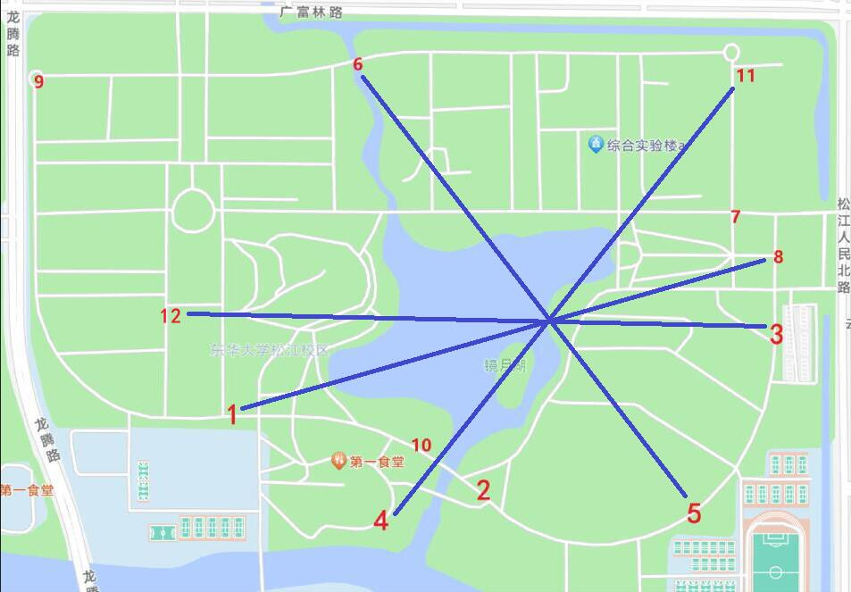

### 解析

简单来讲，把题给八张照片的具体地点在学校地图上标出来，两两连线的交点处就是目标地，湖心岛对面的大石头或者校友林：

（如果画完之后连线不在同一个点上，那麻烦把线画直一点）

二阶段提示的四个关键词——**如果四个一起搜的话**——很容易找到是《名侦探柯南》的一话：[《月亮、星星与太阳的秘密》](https://zhuanlan.zhihu.com/p/124287791)。该话最后的谜题也是“零散的点之连线交于一点”的大体思路。没有完全复刻原思路（指各个点之间的指向信息）是因为鄙人记性不好，提出题目思路的时候忘了（

因为题目图片较大，节省流量起见，这里就不放到页面上了，需要的同学可以在images目录自取。下面是文件名对应上面地图的编号，其中1、3、4、5、6、8、11、12八张图是题目附件。

1. [3C52345901C72EA35A1DD6A3CF100957](photo/3C52345901C72EA35A1DD6A3CF100957.jpg)（附件）
2. [EEDB75099672CD2FF1347D0C4EC362D6](photo/EEDB75099672CD2FF1347D0C4EC362D6.jpg)
3. [7CB509CE8A1F47D6E0912E5EFF3822DE](photo/7CB509CE8A1F47D6E0912E5EFF3822DE.jpg)（附件）
4. [A2FABF45406EF91A82774980358B8924](photo/A2FABF45406EF91A82774980358B8924.jpg)（附件）
5. [CE1DBBDE41E0394454D00069C6DA149A](photo/CE1DBBDE41E0394454D00069C6DA149A.jpg)（附件）
6. [E0F89209F351973CEF5B0C22BE379A88](photo/E0F89209F351973CEF5B0C22BE379A88.jpg)（附件）
7. [4C3C48DF24DAED0FB76AA5A93671ADB9](photo/4C3C48DF24DAED0FB76AA5A93671ADB9.jpg)
8. [A813422600E2A5992A3DD6F0A8530F61](photo/A813422600E2A5992A3DD6F0A8530F61.jpg)（附件）
9. [D0DBFFDACEE43A0404587AAD0E84DCF3](photo/D0DBFFDACEE43A0404587AAD0E84DCF3.jpg)
10. [F7B687D05B176F8B618A29796C74A475](photo/F7B687D05B176F8B618A29796C74A475.jpg)
11. [B450E165939B2AD4FCDC20F1080C467C](photo/B450E165939B2AD4FCDC20F1080C467C.jpg)（附件）
12. [471445B295BDBCF90A733099AE78BB55](photo/471445B295BDBCF90A733099AE78BB55.jpg)（附件）

