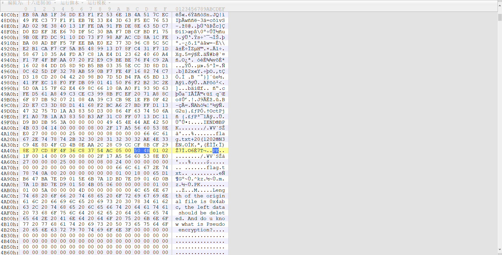
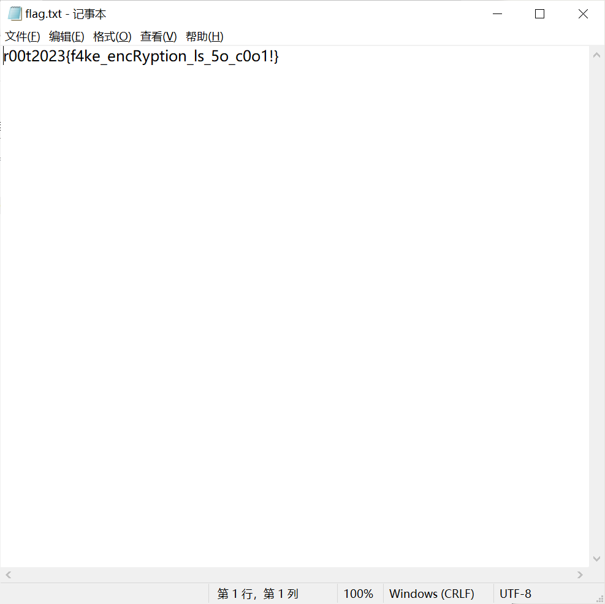

## 神秘的GS球

### Celebi

显然是图片隐写，GS球内藏着一只可爱的雪拉比和可爱的小卡比兽，用stegsolve查看图片RGB的通道，会发现各通道的通道2和通道0都有奇怪的连续像素：

预览一下会发现其中两个通道各藏着一张图片

通道2：

导出为"kabi.png"（Save Bin按钮可以直接保存成二进制文件）：

通道0：

导出为"celebi.png"：

至此第一个flag（藏在"celebi.png"中）已经得到，那显然第二个flag藏在"kabi.png"中

### Kabi

010打开"kabi.png"观察，PNG数据后有"PK"字符并紧跟着"flag.txt"，疑似藏有ZIP压缩包。将文件更改成"kabi.zip"并尝试打开，会发现这里面确实藏有一个ZIP压缩包，但设置有密码。回到010中，锁定到ZIP文件数据的最后，会发现一串字符提示：

提示分为两个，提示1说明文件的原长度是0x4abc，多余的内容需要删除；提示2则暗示ZIP文件经过了伪加密处理。

先将0x4ABC开始的所有内容删除：

再根据[伪加密](https://blog.csdn.net/qq_32350719/article/details/102661596)的特点，先寻找压缩源文件目录区： `50 4B 01 02 1F 00 14 00` ，后跟全局方式位标记 ，更改标记位（从 `09 00` 改为 `00 00`）再重新解压即可得到flag：

