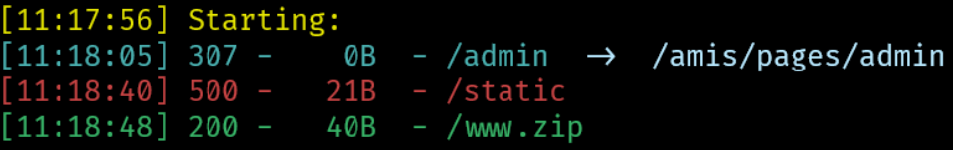

# phishing

- 出题人: pyy

- 验题人: pyy

## 题目描述

去年钓鱼网站竟然真的骗到了不少人! 这次pyy竟然有故技重施, 想要骗大伙的分! 现在报仇雪恨的时候到了~

真有人的钓鱼网站后台放在这种显眼的地方(咦, 什么东西闪过去了), 而且还用弱用户名和密码? 而且这平台也太烂了吧, 会对用户名和密码分别报错诶.......

tips: 大伙知道什么是dirsearch嘛~ 那么wfuzz呢~

tips2: 哇偶, wfuzz是不是不太擅长json的爆破? 或许是cmd的问题? 是不是加个反斜杠会好一点~

**第二阶段提示:**

- 后台页面? 用dirsearch扫一把, 注意输入的路径噢~
- wfuzz不好用的话, 自己写脚本/yakit/burp(付费版)也是好用哒
- 我们的目的是读取根目录上的文件, 好像是任意文件读的范畴? python上传文件好像不能做什么, 但它自动解压......? (解压路径需要抓包看------)
- 用任意文件读把源码扒下来看看!

## 出题思路

这是继承去年钓鱼网站的钓鱼网站部署项目, 可以上传网站代码并自动mock(如果我做的再好点就是输入一个url自动爬取并mock, 但懒得做了另外又不是要做黑产()). 进来会先跳转到一个ctrl+s出来的新生赛登录界面, 如果你在这里输入了正确的用户名和密码就会在后台提交**愿者上钩**的第二个flag, 于是你的100分就消失啦!

`在5/3前做出愿者上钩第二题的方法`: 使用端口扫描扫到这道还没放出的题, 并且交自己的用户名和密码(去年有人在放题之前就扫端口进了题捏)

## 解法

### flag1

`python dirsearch.py -u http://121.5.48.11:20021/`



访问`www.zip`即可

### flag2

使用了[TheKingOfDuck/fuzzDicts: Web Pentesting Fuzz 字典,一个就够了。](https://github.com/TheKingOfDuck/fuzzDicts)

`wfuzz -z file,"fuzzDicts\userNameDict\top500.txt" -d '{\"username\":\"FUZZ\",\"password\":\"123\"}' -H 'Content-Type: application/json'  --hs "用户名错误" http://121.5.48.11:20021/admin`

wfuzz需要用转义字符描述包内容, 以及content-type为json, --hs隐藏包含`用户名错误`的返回信息. 由于会对用户名和密码的错误分别报错, 所以分别将用户名和密码改为FUZZ.

扫出来发现用户名是admin, 密码是qwertyui. 强度都很弱.

### flag3

谷歌搜索`任意文件读 自动解压`可得上传软连接后读取文件的方法. 

> Linux软连接（symbolic link）是一种特殊的文件类型，它允许一个文件或目录链接到另一个位置。和硬链接不同，软连接并不是基于inode进行链接，而是基于路径进行链接。
>
> 软连接可以方便地创建一个指向某个文件或目录的快捷方式，使得用户可以通过软连接访问到目标文件或目录，而无需知道其真实的物理路径。软链接还可以跨越文件系统边界，因为它只是一个指向目标文件或目录的路径名，而不是直接访问目标文件或目录。
>
> 在linux中，可以使用ln命令来创建软连接。例如，在当前目录下创建一个指向/usr/share/doc目录的软连接，可以执行以下命令：
>
> ```sh
> ln -s /usr/share/doc doc
> ```
>
> 执行后，会在当前目录下生成一个名为doc的软链接文件，并且该软链接将指向/usr/share/doc目录。

所以在wsl中创建一个软连接, 指向flag3的位置, 然后压缩后上传, 根据返回路径访问对应软链接, 即可获取flag文件.

[一个有趣的任意文件读取](https://xz.aliyun.com/t/2589#:~:text=解决方案)

flag3文件内容:

```
r00t2023{Ar01rary_file_reading_can_bring_you_more!}

太好了, 真有人能做到这一步!
既然你能读取任意文件, 那么你就可以拿到所有的源码, 然后就可以看看能不能rce!
flag4在另一个奇怪的目录, 想必不能rce是不会知道在哪里的

提示:
这个项目的文件树

/app
├── README.md
├── requirements.txt
├── run.py
├── sql.db
└── src
    ├── __init__.py
    ├── app
    │   ├── __init__.py
    │   ├── amis_router.py
    │   ├── main_router.py
    │   └── mock_router.py
    ├── conf
    │   ├── __init__.py
    │   ├── amis.json5
    │   ├── amis_template.py
    │   ├── app.json5
    │   ├── funcs.py
    │   ├── log.yaml
    │   ├── main.json5
    │   ├── mock.json5
    │   ├── sql.json5
    │   └── sql.json5.example
    ├── log
    │   ├── debug.log
    │   ├── info.log
    │   └── warning.log
    ├── main_app.py
    ├── model
    │   ├── __init__.py
    │   └── response.py
    ├── sql
    │   ├── __init__.py
    │   ├── amis.py
    │   ├── base.py
    │   ├── mock.py
    │   └── phish.py
    ├── static
    │   ├── money.jpg
    │   └── upload
    │       └── game
    │           ├── R0v0T CTF_files
    │           │   ├── 2.634ed0a6.chunk.js.下载
    │           │   ├── anticheat.js.下载
    │           │   ├── main.a2cecbaa.chunk.css
    │           │   └── main.ce4ea00a.chunk.js.下载
    │           └── index.html
    └── utils
        ├── __init__.py
        ├── misc.py
        └── ui.py
```

### flag4

使用给的文件树爬几个感兴趣的文件下来可以得到发现在`/app/src/app/main_router.py`中有

```python
from jinja2 import Template

# 上传template文件, 使用regex检测模板中{{.*}}的内容, 限制模板只能是phish_url, 然后随机分配一个路径
template_pt = re.compile(r"{{.*}}")
@main.post("/template")
async def ssti(html: str = Body(..., embed=True),
               sess: AsyncSession = Depends(db_sess),):
  tp = re.findall(template_pt, html)
  for each in tp:
    if each != '{{phish_url}}':
      raise AmisExp("模板只能是{{phish_url}}!")
  path = uuid4().hex
  sess.add(PhishTemplate(path=path, html=html))
  return AmisRes(f"模板路径: /t/{path}", msg_timeout=30000)

#从数据库取出模板文件, 然后使用jinja渲染
@main.get("/t/{path:path}")
async def get_template(path: str = Path(...),
                       sess: AsyncSession = Depends(db_sess),):
  html = await sess.scalar(select(PhishTemplate.html).filter_by(path=path))
  if html is None:
    return Response(status_code=404)
  return HTMLResponse(Template(html.replace("{{phish_url}}", "/phish/give_me_password")).render())
```

发现过滤了`{{xxx}}`但没过滤``, 查一下发现有现成的payload: [以 Bypass 为中心谈 Flask-jinja2 SSTI 的利用](https://xz.aliyun.com/t/9584#toc-23)

```

```

改一下执行的命令为反弹shell命令即可, 没有服务器的小伙伴可以用内网穿透, 还是有一些免费的的。

> 反弹shell（Reverse Shell）是指攻击者通过在目标系统上运行恶意软件，利用网络连接将控制权反向传输到攻击者的机器，从而使攻击者能够完全控制目标系统。具体来说，攻击者会在目标系统上运行一个后门程序，等待攻击者从自己的机器上发起连接请求，并在连接建立后将控制权交给攻击者，使攻击者能够在目标系统上执行任意操作，包括文件操作、进程管理、网络操作等等。
>
> 反弹shell常用于渗透测试、黑客攻击等领域，攻击者可以通过反弹shell来窃取敏感信息、操纵目标系统、扩大攻击面等，因此也是网络安全工程师需要重点防范的一种攻击方式。
